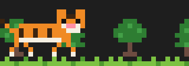

# likephp-mods

兩個 Claude Code mods（以 function hooks 寫成的 plugin）。

> 這是個人作品，與 Anthropic 無關。Mods 是 Claude Code 的 early access 功能，需要 Claude Code 2.1.287 以上版本；API 可能隨版本變動。

## 安裝

在 Claude Code 裡輸入：

```
/plugin marketplace add likephp-github/likephp-mods
/plugin install token-weather@likephp-mods
/plugin install session-radar@likephp-mods
```

兩個 mod 互相獨立，可以只裝其中一個。

## token-weather

在輸入框上方顯示兩行：

```
☂ 陣雨 45%  90k/200k  ▂▃▄▅  上一輪 +8.3k
[Opus 5.5] │ my-project (main) │ 5h ██▌░░░░░ 32% (3h 41m後重置) │ 7d 18% │ ⏱ 18m │ $1.23
```

- 第一行：context 用量的天氣（☀ 晴 <25%、☁ 多雲、☂ 陣雨、☇ 暴風雨、↯ 即將壓縮 ≥90%）、已用／總 token、最近 12 次的走勢、上一輪增量
- 第二行：模型、專案與 git 分支、5 小時／7 天用量限制與重置時間、session 時長、費用
- `/token-weather`：切換顯示；也可 `/token-weather on|off|status`

## session-radar

側邊面板列出本機所有正在執行的 Claude Code session（讀取 `~/.claude/sessions/*.json`，每 3 秒更新）：

```
7 個 session · 1 個工作中 · 藍色為本視窗
● my-project-f8 工作中 3秒
○ api-server-d8 閒置 12分
◆ web-fb shell 2時
```

面板底部住著一隻 8-bit 老虎，體型隨本 session 的 context 用量變大變小（100% 時為面板容得下最大尺寸的一半，最多 1.5 倍；最小 0.5 倍）。

| 狀態 | 動作 |
|---|---|
| **巡邏**<br>執行中 | <br>左右來回走 |
| **抓蝴蝶**<br>回覆結束後 30 秒內 | <br>甩尾、壓低身體、跳起來拍掌邊的蝴蝶 |
| **睡覺**<br>閒置 30 秒後 | <br>呼吸起伏、抖尾巴、抖耳朵、打呼 |

> 動作圖由 mod 內實際的像素圖與動畫邏輯產生；終端機裡以半格字元繪製，蝴蝶與打呼為文字符號（`ʚɞ`、`z Z`）。

`/sessions`：開關面板（不會自動開啟）。面板在全螢幕版面下會停靠在右側。

## 安全性

Mods 不在沙盒裡執行，安裝前請先閱讀原始碼。這兩個 mod 只讀取：

- token-weather：本 session 的用量資訊、git 的 `.git/HEAD`
- session-radar：`~/.claude/sessions/*.json`（不讀取同目錄的 `.key` 檔）

都不會連網、不會寫入任何檔案。

## 開發

```
claude plugin validate ./token-weather
claude plugin test ./token-weather
```

## License

MIT
