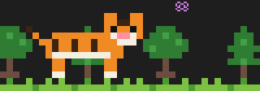
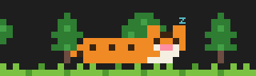
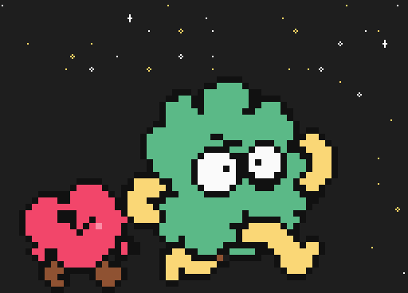
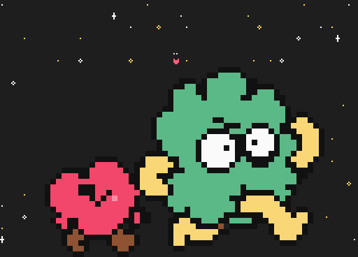
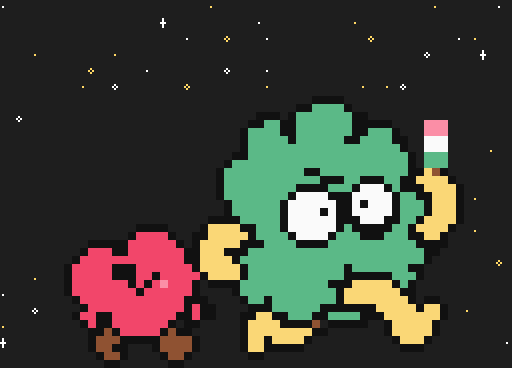

# likephp-mods

兩個 Claude Code mods（以 function hooks 寫成的 plugin）。

> 這是個人作品，與 Anthropic 無關。Mods 是 Claude Code 的 early access 功能，需要 Claude Code 2.1.287 以上版本；API 可能隨版本變動。

## 安裝

在 Claude Code 裡輸入：

```
/plugin marketplace add likephp-github/likephp-mods
/plugin install token-weather@likephp-mods
/plugin install session-radar@likephp-mods
```

兩個 mod 互相獨立，可以只裝其中一個。

## token-weather

在輸入框上方顯示兩行：

```
☂ 陣雨 45%  90k/200k  ▂▃▄▅  上一輪 +8.3k
[Opus 5.5] │ my-project (main) │ 5h ██▌░░░░░ 32% (3h 41m後重置) │ 7d 18% │ ⏱ 18m │ $1.23
```

- 第一行：context 用量的天氣（☀ 晴 <25%、☁ 多雲、☂ 陣雨、☇ 暴風雨、↯ 即將壓縮 ≥90%）、已用／總 token、最近 12 次的走勢、上一輪增量
- 第二行：模型、專案與 git 分支、5 小時／7 天用量限制與重置時間、session 時長、費用
- `/token-weather`：切換顯示；也可 `/token-weather on|off|status`

## session-radar

側邊面板列出本機所有正在執行的 Claude Code session（讀取 `~/.claude/sessions/*.json`，每 3 秒更新）：

```
7 個 session · 1 個工作中 · 藍色為本視窗
● my-project-f8 工作中 3秒
○ 2: api-server-d8 閒置 12分
◆ 1: web-fb shell 2時
```

**跳到其他 session**：輸入 `/sessions 2` 就把面板上編號 2 的 session 所在的終端機分頁帶到最前面；也可以用滑鼠點面板上的 session 名稱（全螢幕版面）。

- 數字依 session 啟動先後編號（最多 9 個），清單重新排序時不會變；本視窗那一行沒有編號
- 支援 tmux、iTerm2、Terminal.app。session 在 tmux 裡時會先切到它的 pane；那個 tmux session 沒有連線中的 client 時，本視窗在 tmux 裡就直接切過去，否則提示 `tmux attach -t <名稱>`
- 第一次使用時 macOS 會詢問是否允許控制 iTerm2／Terminal.app；拒絕後可到「系統設定 › 隱私權與安全性 › 自動化」重新允許

面板底部有一組像素角色演出本 session 的**狀態**，角色與背景由**主題**決定。狀態只有三種，與主題無關：

- `working`：執行中
- `resting`：回覆結束後 30 秒內
- `idle`：閒置超過 30 秒

每個主題在三個狀態各有自己的**動作**。角色體型隨本 session 的 context 用量變大變小（100% 時為面板容得下最大尺寸的一半，最多 1.5 倍；最小 0.5 倍）；面板比角色窄時不畫角色。

### 主題

`/sessions theme` 依序切換到下一個主題，`/sessions theme tiger` 或 `/sessions theme puma` 直接指定。選擇會寫進 `~/.claude/session-radar.json`（例如 `{ "theme": "puma" }`，保留檔案裡的其他欄位），之後每個 session 都沿用；沒有這個檔案時用小老虎。

#### 小老虎（`tiger`，預設）

老虎住在綠色的樹林裡：身後是一排樹，腳下是一行草地。樹固定高度、不隨老虎縮放，可以當比例尺看出老虎變胖了多少。老虎走動時背景以視差方式往反方向捲動（樹走得慢、草跟老虎同速），老虎停下來抓蝴蝶或睡覺時背景也停住。面板太矮放不下樹時只畫草地。

| 狀態 | 動作 |
|---|---|
| **`working`**<br>執行中 | <br>巡邏：左右來回走 |
| **`resting`**<br>回覆結束後 30 秒內 | <br>抓蝴蝶：甩尾、壓低身體、跳起來拍掌邊的蝴蝶 |
| **`idle`**<br>閒置 30 秒後 | <br>睡覺：呼吸起伏、抖尾巴、抖耳朵、打呼 |

#### 綠雲與愛心（`puma`）

綠雲帶著愛心住在閃爍的星空裡：沒有地面，角色腳底貼著面板底部；星星（`·`、`✦`、`✧`）位置固定，約一半會閃爍，不會蓋在角色或對話框上。最小倍數同樣從 0.5 倍起算，縮得太小看不到綠雲的黑眼珠時會自動稍微放大。

| 狀態 | 動作 |
|---|---|
| **`working`**<br>執行中 | <br>走路：12 格走路圖循環，左右來回走，愛心跟在後面 |
| **`resting`**<br>回覆結束後 30 秒內 | <br>♥＋名言：停在原地，頭頂冒出 ♥，上面隨機出現一句名言 |
| **`idle`**<br>閒置 30 秒後 | <br>吃丸子：一顆顆吃掉手上的三色丸子（吃到剩 2 顆時頭頂冒出 `nom`），吃完換新的一串 |

`resting` 的名言每進入一次 `resting` 隨機挑一句，這段期間不換；前後加「」，對話框自動換行，最多 3 行，面板太矮時縮成 1 行或只留 ♥：

1. 我們不要灰心，我們也不應該喪志，為什麼？因為我來了。
2. 人類的讚歌就是勇氣的讚歌，我們會把勇氣繼續傳承下去。
3. 如果有人說懷抱希望是一種錯誤，那麼我會每一次都反駁他。無論幾次，我都會堅定地說。
4. 未來的事情無人知，但就是因為這樣，可能性才會如此強大。
5. 我本來就不是以外表取勝。
6. 洋流是溫暖的，可以帶來漁獲，不會燙傷人。

> 動作圖由 `scripts/gen-gifs.ts` 以 mod 內實際的像素圖與動畫邏輯產生；終端機裡以半格字元繪製，蝴蝶、打呼、♥、星星與 `nom` 為文字符號。小老虎的圖是 40 欄寬、1 倍；綠雲與愛心的圖用原圖大小（1 倍）以看清楚臉，面板放寬到 64 欄。GIF 不畫中文，名言的位置以 `…` 代替。

`/sessions`：開關面板（不會自動開啟）；`/sessions 1`～`/sessions 9`：跳到該編號的 session；`/sessions theme [tiger|puma]`：切換主題。面板在全螢幕版面下會停靠在右側。

## 安全性

Mods 不在沙盒裡執行，安裝前請先閱讀原始碼。這兩個 mod 只讀取：

- token-weather：本 session 的用量資訊、git 的 `.git/HEAD`
- session-radar：`~/.claude/sessions/*.json`（不讀取同目錄的 `.key` 檔）、`~/.claude/session-radar.json`（選的主題）

都不會連網。唯一會寫入的檔案是 session-radar 在你執行 `/sessions theme` 時寫的 `~/.claude/session-radar.json`。

session-radar 只有在你按下某個 session 時，才會執行 `ps`（查它的 tty）、`tmux`（找 pane、切換）與 `osascript`（選取 iTerm2／Terminal.app 的分頁）；不會啟動沒在執行的終端機 app。

## 開發

```
claude plugin validate ./token-weather
claude plugin test ./token-weather
```

session-radar 的動作圖（`docs/images/<主題>-<狀態>.gif`）由腳本產生，每一格都用面板同一套動畫邏輯算出；改了主題的角色、背景或動作後重新產生：

```
node scripts/gen-gifs.ts            # 重新產生每個主題 × 每個狀態的 GIF（需要 Node 24，不需安裝套件）
node scripts/gen-puma.ts            # 從原圖重新產生綠雲與愛心的走路圖與預覽圖（docs/images/puma-preview.png）
node --test 'scripts/*.test.ts'     # 腳本的測試
```

## License

MIT
